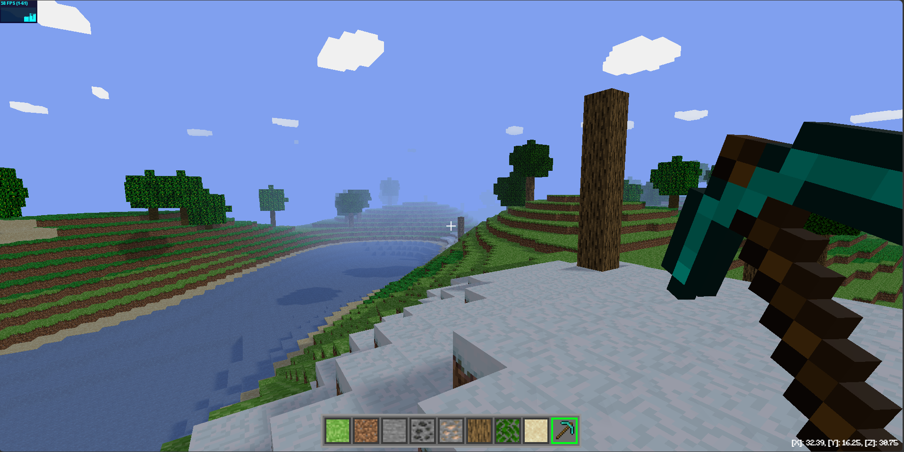

# Minecraft JS Clone ⛏️​​​​🌳​

A Minecraft-inspired project built with JavaScript and Three.js.

This project is inspired by the work of Dan Greenheck, and it keeps the original reference link below:

- https://github.com/dgreenheck/minecraft-threejs-clone
- https://www.youtube.com/watch?v=tsOTCn0nROI&list=PLtzt35QOXmkKALLv9RzT8oGwN5qwmRjTo

## Features ⚙️​🔧

- Ability to change the world seed, player or generation parameters using the GUI (press "U" key)
- Procedural world generation based on noise algorithms
- Infinite world experience
  - (if new chunks are not generated while walking, reduce the "Distance Draw" value in the GUI, this depends on your computer)
- Different biomes (generation based on humidity and temperature parameters)
- Different trees/cacti depending on the biome
- Stone and ore generation
- Place and remove blocks
- Tool bar with selection by number keys or mouse wheel
- Running ability
- Zoom support
- Pseudo water
- Reduced movement speed underwater
- World saving to local storage
- Loading the saved world from local storage

## Live Demo 🚀⚡

- https://apgallego.github.io/minecraft-js/
  [Landing Page](live-demo-1.png)
  
